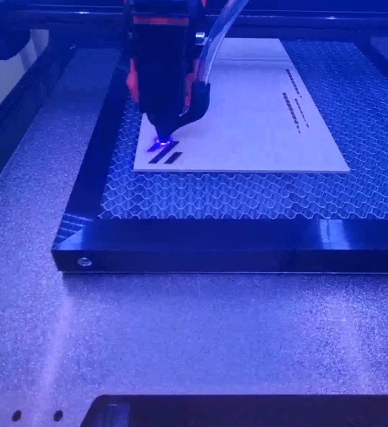
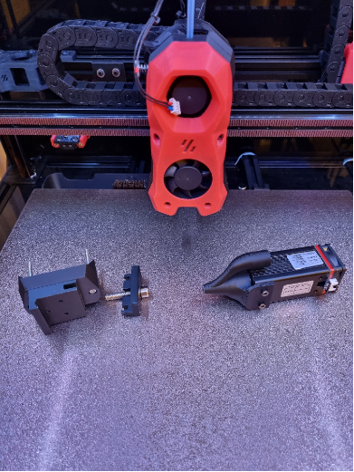
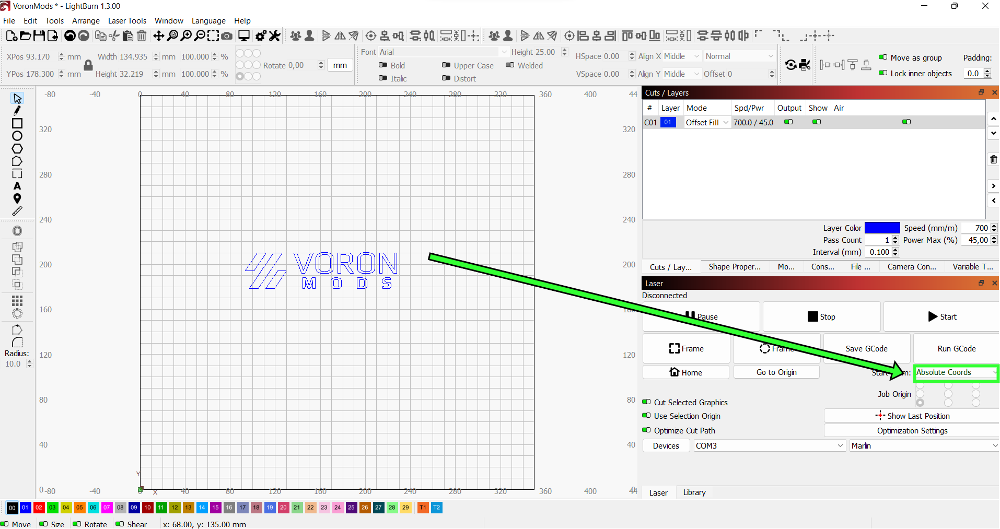
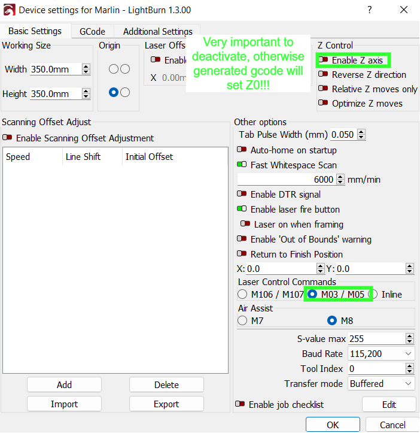
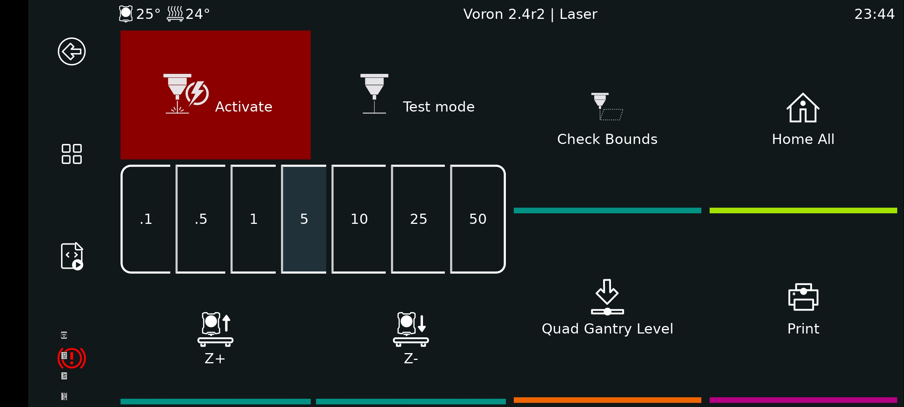

# Voron 2.4 Laser Mod

In this project I share how to attach a laser to Voron 2.4 r2. The main goal was to keep the setup time between 3d printing & lasering as small as possible in combination with a "safe" assembly. You need a printed mount platform which is attached to the stealthburner cover with two screws. If you have an enclosed voron you need to open the doors during bed mesh leveling & quad gantry leveling otherwise the laser will crash into them due to the extended X carriage size.

:warning: **Lasers are dangerous**: Protect your eyes with safety goggles and have fire extinguishers on hand. Lasers will blind you if you don't protect your eyes! Take care that no unprotected humans & pets are in the room or can look into the laser.

## Video

<a href="https://streamable.com/fsrknh" title="Video"></a>

## Used Hardware

- Voron
  - Voron 2.4 r2 350x350 with Octopus V1.1  
  - Voron Stealthburner
- Neje
  - Laser N30610
  - Laser switch / test board for Neje laser module
  - z axis adjuster (with screws provided by Neje)
- PCBs
  - EA60-12V TOBSUN step down converter 24v o 12v
  - DollaTek Electronic Switch (optional)
- Cables
- Screws
  - Laser mount: 2x40mm M3 screws
  - Air assist/laser cover: 2x5mm M3 screws
  - PCB mount: can't remember

## Used Software

- [Klipper](#klipper-config)
- Moonraker (won't be detailed)
- Fluidd (won't be detailed)
- [KlipperScreen (TBD)](#klipperscreen)
- [Lightburn](#gcode-generation)

## Wiring

Due to safety concerns I have decided to use a separate switch which controls the general power supply of the laser. You need to route the 4 wires through the cable chains to the print head.

|Wiring illustration|Real wiring
|----|---|
|| |

## Printed Parts

- [Laser Mount](STLs/)
- [Laser PCB Mounts](STLs/)
- [Air Assist (optional)](STLs/)

## Laser Mount Assembly

|#1|#2|
|:--------:|:--------:|
|||
|#3|#4|
|||

## Software Settings

### Klipper Config

Add the following configs & macros to printer.cfg

```cfg
#####################################################################
#   LASER Control
#####################################################################

[output_pin laser_switch_pin]
pin: PB4
pwm: false

[output_pin laser_pwm_pin]
pin: !PD15 
pwm: true
cycle_time: 0.001

[gcode_macro M03]
gcode:
 
    SET_PIN PIN=laser_pwm_pin VALUE={S / 255.0}

[gcode_macro M04]
gcode:
 
    SET_PIN PIN=laser_pwm_pin VALUE={S / 255.0}

[gcode_macro M05]
gcode:
    SET_PIN PIN=laser_pwm_pin VALUE=0

[gcode_macro LASER_TEST_ON]
description: Turn laser test mode on
gcode:
    SET_PIN PIN=laser_pwm_pin VALUE=0.01

[gcode_macro LASER_TEST_OFF]
description: Turn laser test mode off
gcode:
    SET_PIN PIN=laser_pwm_pin VALUE=0

[gcode_macro LASER_ON]
description: Turn laser on
gcode:
    SET_PIN PIN=laser_switch_pin VALUE=1

[gcode_macro LASER_OFF]
description: Turn laser off
gcode:
    SET_PIN PIN=laser_switch_pin VALUE=0
#####################################################################
```

### Gcode generation

I decided to use Lightburn to create the necessary gcode. Main focus is on the usage of the M gcode commands for the laser and absolute coordinates usage due to printer boundary concerns. Last mentioned can be changed to relative but was not jet tested by me. Be aware to deactivate Z axis in lightburn, otherwise it will set Z0 which will cause a crash into the honeycomb board/material you want to laser.

There are plenty more options to tweak the laser quality in lightburn which I have not yet tested. For first usage the settings below are sufficient.

| Print Settings | Device Settings|
|-----------|----------|
| Set absolute coordinates| Deactivate Z & use M gcodes|
|||

Once gcode file is created I uploaded it via Fluidd to the printer.

### KlipperScreen

It is very difficult to determine with absolute coordinates where the laser is going to do its job. Here is a very basic python script which traces the outer boundaries of the expected cut. For visualization purpose one has to manually activate the laser test mode during execution.

#### Installation:

1. Copy the files to corresponding folders
   - Copy the files (panels & styles) from [KlipperScreen](/KlipperScreen) to local installation folder
   - Copy the [KlipperScreen.conf](/klipper_config/KlipperScreen.conf) to local folder where the configs are stored
   - Copy the [laser_booundaries.py](/klipper/klippy/extras/laser_boundaries.py) to the extras folder of klipper installation
   - Copy the file & include the [laser_boundaries.cfg](/klipper_config/laser_boundaries.cfg) in the printer.cfg
2. Restart klipper
3. Restart KlipperScreen

#### KlipperScreen Menus

|Main screen extension|Laser screen
----|---|
| In the lower right corner you can find a laser icon which brings you the desired menu   | In this menu the laser switch and test mode can be de/activated. The test mode runs the laser at 0.01% of its power. Special feature is the Laser boundary code which takes the newest print file & traces its boundaries   |
| ||

#### Laser Boundaries Script

Not very professional, but it does it's job. Once started the toolhead is tracing the boundaries of the print. If laser test mode is activated the area can be seen where the laser will work. The test mode is not automatically set due to safety reasons.


## Potential area of Improvement

1. [ ] Development of a less space consuming laser mount to avoid crashes into the front doors and to maximize the usage of laser area.
2. [ ] Development of a safe laser mount without the need of screws
3. [ ] Direct deployment of gcodes to klipper from lightburn including the usage of the trace boundary feature from lightburn
4. [ ] Enable the user to select the file which should be considered by the laser_boundaries.py script
5. [ ] Porting the inline laser feature known from Marlin to Klipper to increase printing speed
6. [ ] Stronger chamber ventilation required to get rid of the amount of smoke as you might see in the video
7. [x] KlipperScreen menu could be improved by toggling buttons for laser switch and test mode
8. [x] KlipperScreen menu could be improved by Z axis adjustment functions
